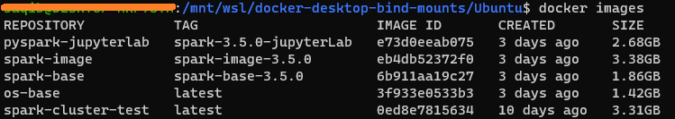
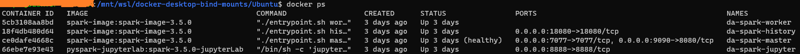

# Setup Apache Spark Cluster Using Docker

This repository demonstrates Apache Spark Cluster setup using Docker. The main objective of this working is to setup a base layer of docker container with parameterized base-script. To understand the working structure, build.sh is the main bash script file. 

To leverages the solution build is the main folder, which contain respective different folders.

## File Structure
```
├── README.md
├── docker
│   ├── build.sh
│   ├── .docker-compose.yml
│   ├── .env.spark
│   ├── book_data
│   │   └── pride-and-prejudice.txt
│   ├── spark_apps
│   │   └── word_non_null.py
│   ├── notebooks
│   │   ├── sample2.txt
│   │   └── Untitle.ipynb
│   └── build
│       ├── juypter-lab
│       │    └── Dockerfile
│       ├── os-base
│       │    ├── Dockerfile
│       │    └── entrypoint.sh
│       ├── spark
│       │    ├──conf
│       │    │   └── spark-default.conf
│       │    ├──requirements
│       │    │   └── requirements.txt
│       │    ├── Dockerfile
│       │    └── entrypoint.sh
│       └── spark-base
│           └── Dockerfile

```
## Features
- **Batch Script:** Automates the Docker Image setup.
- **Jupyter Lab:** To get hand-on on the Apache spark, we setup Pyspark with juypter lab.
- **Core Apache Spark Image:** Get different docker images like os-base, spark-base and many more.

## Prerequisites
- Docker
- Docker Compose
- Windows WSL (When using Windows OS)

## Instructions

### Step 1: Batch Script Execution
Navigate to the /docker directory and initialize docker-compose.
```bash
cd ../docker

./build.sh
```
After running the above batch script, you will get different docker images.



### Step 2: Use Docker Compose
Now using docker compose you can spin multiple docker containers. In this case we spin only 1 machine spark worker, you can spin multiple spark-worker just by change the value.
```bash

docker-compose up --scale spark-worker=1

```



This project demonstrates a scalable and efficient solution for managing & apache spark cluster setup. 